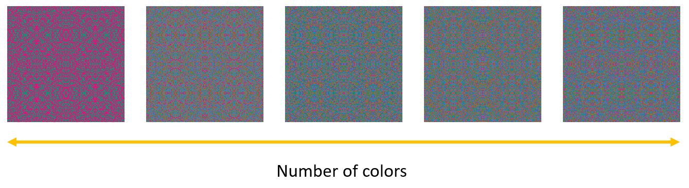

# Symmetric stimuli generator :butterfly:	

This tool is a symmetric stimuli generator that allows you to generate random dot symmetric images with different luminance, chromaticity, spacing and dot density conditions. Also, the generated symmetric images can be saved directly to a designated folder. This work was developed during my master thesis; please use it responsibly and ensure it fits your needs. A tutorial on how to use this application is shown on the tutorial.ipynb file

## How to run it
Execute the `symmetric_stimuli_generator.py` file, for example, with `python symmetric_stimuli_generator.py`. 

## Requirements
This work has been mainly developed with the NumPy library.

## Features
This generator offers the following features:
- **Signal Size**: Defines the width and height of the stimuli.
- **Number of Axes**: 
  - `1 Axis`: Vertical symmetry 
  - `2 Axes`: Both horizontal and vertical symmetry 
  - `4 Axes`: Circular symmetry
- **Density**: Ranges from 0 to 1, representing the probability of placing a dot on the stimuli. A density of 1 means the signal is entirely filled with dots.
- **Spacing**: Dictates the minimum distance between each dot.
- **Number of Color Patterns**: Sets the color schemes used in the symmetric image, vital for generating color stimuli.
- **Adjustment Color Factor**: Allows for variations between color symmetry and asymmetry.
- **Block Size**: Specifies the size of each block in the symmetric signal set to be randomized, aiding in disrupting the overall signal symmetry.

### Some examples of these features are shown below:

